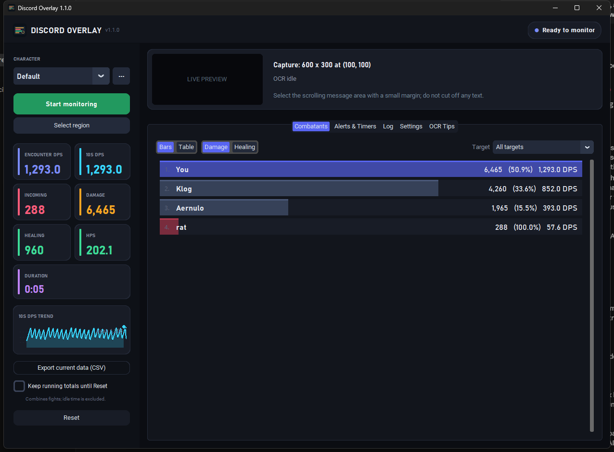

# Discord Overlay

A Windows desktop combat parser that reads only the pixels in a screen region you
select. It OCRs the game's combat chat, computes DPS/HPS and per-combatant totals,
and drives sound, speech, and on-screen timer alerts from the recognized text. It
never reads game logs, inspects process memory, injects code, hooks the client,
or sends input to the game.

Free to use. There is no license server, no update check, and no telemetry.



## Install (no Python needed)

1. Open the **[Releases](../../releases/latest)** page and download
   `DiscordOverlay-<version>.zip`.
2. Right-click the zip and choose **Extract All**, putting the folder anywhere you
   like (Documents works well). Open the folder and run `DiscordOverlay.exe`.
   Windows may say "Windows protected your PC" because the program is not
   code-signed: click **More info**, then **Run anyway**.
3. On first launch, accept the offer to add **Discord Overlay** to your Start Menu
   (you can also add Start Menu or desktop shortcuts later under Settings).
4. Follow the first-time setup: select the combat region, run the capability test,
   and apply its recommended scan interval.
5. In game, make a chat tab that contains only combat messages, ideally on a black,
   opaque background with a larger font.
6. Click **Start monitoring** before you pull.

The build uses DirectML for GPU acceleration, which works on NVIDIA, AMD, and Intel
graphics and falls back to CPU automatically. To update, extract the new zip over
the old folder (or delete the old folder); your settings are kept because they live
outside the program folder.

## Run from source (optional)

If you would rather run the Python code, or want NVIDIA CUDA acceleration:

1. Install **Python 3.12 (64-bit)** from python.org.
2. Clone or download this repository and double-click **`run.bat`**. The first launch
   creates a private `.venv`, detects your graphics card, and installs the matching
   ONNX Runtime (NVIDIA CUDA, AMD/Intel DirectML, or CPU). Later launches are fast.

Selecting a region darkens every monitor. Left-drag around the scrolling combat
text, leaving a small margin and never cutting through letters. Release to save,
press Esc or right-click to cancel. The eight most recent regions appear as dashed
gold rectangles; click one to reuse it. Right-click clears them.

Settings live in `%LOCALAPPDATA%\DiscordOverlay` and survive updates and uninstalls.

### Why Windows warns about the program

Windows SmartScreen shows "Windows protected your PC" for any program that is not
signed with a code-signing certificate and has not yet been downloaded by many
people. Discord Overlay is not signed. A code-signing certificate costs a few
hundred dollars a year and requires identity verification, and that will not be
done for this free project. The warning does not mean anything harmful was
detected; it only means Windows does not recognize the publisher. Click **More
info**, then **Run anyway**. Every release build is scanned with Windows Defender
before it is published. The complete source is in this repository if you want to
check what the program does or build it yourself.

## What you get

**Combat parsing**
- Encounter DPS, 10-second DPS, incoming damage, healing, HPS, and duration.
- A **Combatants** view with classic meter bars (damage or healing) or a full table
  with damage, share, DPS, hits, crits, healing, and HPS per actor, scoped to all
  targets or one target. Sort the table by clicking a heading; drag headings to
  reorder columns (the order is saved). A sidebar sparkline shows the last minute
  of 10-second DPS.
- A chronological **Log** with raw OCR text and confidence, exportable to CSV along
  with the Combatants summary.
- Pets are learned automatically from `Your pet Name …` lines. Choose whether pet
  damage merges into your row, and whether damage shields credit the wearer or a
  single `Damage Shield` actor.
- A **mini meter overlay**: a compact always-on-top window with encounter DPS,
  10-second DPS, damage, duration, and the top actor bars, for use while playing.
  Toggle it from the sidebar, drag it into place with **Move overlays**, then
  **Lock overlays** to make it click-through. Its position is saved per character.
- **Running totals** combine fights until Reset while excluding idle time.
- An optional **Group filter** keeps only fights involving you, your pet, or the
  names you list, so nearby strangers are excluded.
- Lines partly hidden by the mouse cursor are repaired from a grammar dictionary
  and from lines seen earlier; repaired rows show `~` in the Log. Numbers are never
  guessed.

**Alerts, overlays, and timers**
- Triggers with Contains / Exact / Regex conditions, ALL / ANY logic, NOT, and a
  multi-line match window. GINA-style regex (`(?<target>…)`, `{S1}`, `{N}`) works.
- Five bundled sounds or your own WAV/OGG/MP3, per-trigger volume and cooldown.
- Windows text-to-speech on trigger, ending-soon, and expiration, with capture
  variables such as `{target}` and `{spell}`.
- Always-on-top countdown overlays. **Timer boards** flow timers into named grids
  with their own position, columns, size, opacity, ordering, and fill direction;
  **Independent** mode gives every trigger or captured timer key its own window.
- Restart / Replace / Ignore / Create-another retrigger behavior, early-ending
  rules, and a modifier-click gesture to dismiss one timer while click-through.
- Named folders, switchable profiles, and JSON trigger packs for sharing.
- A replay tester that explains exactly why a trigger did or did not fire.

**Per-character profiles** keep the capture region, timer boards, active trigger
profile, which triggers are switched on, and the group filter separate for each
character. Triggers themselves are shared, so one library serves every character.
The character name is used for `You`/`Your` attribution.

## Scan rate

OCR is the expensive step, not the screenshot. Chat lines stay visible across
several scans, so the parser matches the previous and current viewport and counts
only appended lines. Faster scanning improves reliability during bursts.

| Situation | Scan interval |
|---|---:|
| Fast measured GPU | 0.20–0.30 s |
| Typical CPU | 0.55–0.75 s |
| Slower computer | 0.9–1.25 s (make the combat panel taller) |

Rerun **Settings > Run hardware setup** after a driver, GPU, resolution, or region
size change.

## Accuracy checklist

- Black, opaque combat background; larger font; wide enough that lines do not wrap.
- Taller panel so more lines survive between scans.
- Keep the mouse pointer and overlay windows out of the capture region.
- Hide message categories you do not need (for example melee misses).
- If real lines are rejected, lower OCR confidence gradually (0.52 → 0.45). If
  garbage appears, raise it.
- Start monitoring before combat; the first visible viewport is only a baseline.

## Developer notes

```bash
py -3.12 -m venv .venv
.venv\Scripts\python -m pip install -r requirements.txt -r requirements-cpu.txt -r requirements-dev.txt
.venv\Scripts\python -m pytest
.venv\Scripts\python main.py
```

Layout:

| Path | Purpose |
|---|---|
| `discord_overlay/parser.py` | Combat-line grammar and OCR-noise repair |
| `discord_overlay/encounter.py` | Encounter clocks, per-actor rows, CSV export |
| `discord_overlay/dedup.py` | Scrolling-viewport line deduplication |
| `discord_overlay/repair.py` | Cursor-occlusion repair from grammar templates |
| `discord_overlay/triggers.py`, `timers.py` | Trigger evaluation and countdown timers |
| `discord_overlay/scanner.py` | Background capture → OCR → parse → trigger loop |
| `discord_overlay/config.py` | Settings with per-character profiles |
| `discord_overlay/ui/` | CustomTkinter windows, tabs, overlays |
| `scripts/build_grammar_seed.py` | Regenerates the shipped grammar dictionary |
| `scripts/build_windows.ps1` | PyInstaller folder build, plus `-Installer` for the Inno Setup installer |
| `scripts/ui_smoke.py` | Drives the real window through its features (`--ocr` starts live monitoring) |

Run `python scripts/build_grammar_seed.py` after adding real combat lines to
`scripts/grammar-samples.txt`; names are masked before anything is written.
